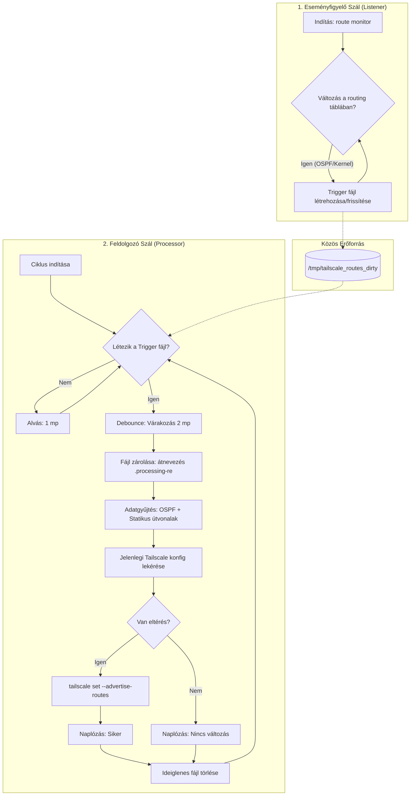

# Homeoffice konfigurációk

Ez a mappa tartalmazza a homeoffice dolgozók csatlakozását lehetővé tevő komponensek beállításait.

- `tailscale_watchdog.service`: rc.d szolgáltatás (daemon) definíció fájl
- `tailscale_watchdog.sh`: Maga a tailscale subnet és ospf management szkript

A szkriptek működése (mermaid markdown):
