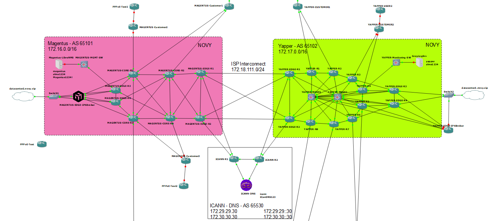

# ISP Konfigurációk

Az ISP routerek, switchek, és monitoring szerverek konfigurációja található ezekben a könyvtárakban.

Az EDGE-R3 és EDGE-R4 eszközök biztosítják az internet felé az alapértelmezett útvonalakat. 
Az EDGE-R1 és EDGE-R2 eszközök biztosítják a másik internetszolgáltató és az ICANN dns kiszolgáló felé a BGP peeringet. 
Valamint a Magentus IP6Broker Mikrotik CHR router biztosítja a teljes hálózat számára az IPv6 elérést.

Az ISP eszközei GNS3 képernyőfotó:

Részletesebb SVG, PDF és draw.io projektfájlok a topológiáról az [IMAGES](../../IMAGES/ISP/) mappában